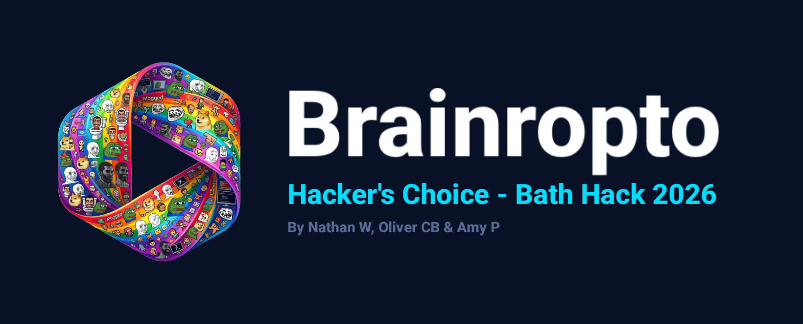

## WHAT IS THIS???

This is the most cooked, unhinged, giga-brainrot lecture enhancer ever made.  
Built to **force you to pay attention** when watching recorded lectures by weaponising memes, chaos, and motion tracking.
Drag tiles. Drop memes. Summon Subway Surfer, Among Us, Minecraft, and more.  
Your attention span is GONE.

## INSPIRATION

Students often struggle to focus when catching up with lectures—especially at home where there’s zero peer pressure.
After watching a maths lecturer and joking about how his *“on one hand, on the other hand”* movement looked suspiciously like the **6-7 gesture**, we thought:

> “What if we could detect that… and punish the user with memes?”

So we challenged ourselves to learn motion tracking in 24 hours and bring this chaotic idea to life.

## WHAT IT DOES

Brainropto takes in:
- A **Panopto / YouTube link**, or  
- A **video file (.mp4)**  

It then uses **real-time motion tracking (MediaPipe)** to analyse the lecturer and trigger events.

### Core features:
- Detects gestures like:
  - **6-7 movement**
  - **Rick Astley dance**
- Displays **visual overlays + memes** when triggered
- Logs key moments so you can **jump back to funny timestamps**

### Attention-forcing chaos:
- 🔊 Random **metal pipe sound** every 3–10 minutes  
- 🚨 “WAKE UP” alert if your **eyes are closed too long**  
- 🤡 Webcam-triggered memes:
  - Mouth open → chaos  
  - Hands on head → DOG  
  - Finger to mouth → SHUSH  
  - Hand flailing → VINE BOOM  

### Side-content brainrot:
Optional “attention bait” videos:
- Subway Surfers  
- Minecraft parkour  
- GTA driving  
- Hydraulic press  

Because apparently… that works.

## FEATURES

- **Drag & Drop Tiles** – Customise your meme layout  
- **Webcam Gesture Detection** – Control chaos with your face/hands  
- **67 & Rickroll Detector** – Instant visual punishment  
- **Sound System** – Pipe drops, alerts, meme audio  
- **Settings Panel** – Mute, hide, or embrace the brainrot  
- **Generation Mode** – Gen Z / Alpha / Boomer meme switching  
- **Event Logging** – Replay detected moments  

## HOW TO USE

1. Open the app → allow webcam (trust us bro)  
2. Paste a lecture link or upload a video  
3. Drag meme tiles wherever you want  
4. Do gestures → trigger chaos  
5. Adjust settings if you're weak  
6. ???  
7. BRAINROT  

## HOW WE BUILT IT

- **Frontend:** React + TypeScript + Vite  
- **Styling:** TailwindCSS  
- **Motion Tracking:** MediaPipe (runs entirely in-browser)  
- **Storage:** LocalStorage (no backend needed)  

Everything runs **client-side**, meaning:
- No servers  
- No latency  
- Just instant chaos  

## CHALLENGES WE RAN INTO

- **Low-quality Panopto recordings**
  - Hands too small/pixelated → poor tracking  
- Solution:
  - Added **.mp4 upload support**, which massively improves accuracy  

- **Transcript limitations**
  - Only downloadable as `.txt`, not accessible via API  
  - Couldn’t integrate due to time constraints  

## ACCOMPLISHMENTS WE'RE PROUD OF

- Surprisingly accurate **gesture detection** after heavy tuning  
- Clean, intuitive UI despite the absolute chaos  
- Fully working **real-time motion tracking in the browser**  
- Actually usable (somehow)

## WHAT WE LEARNED

- How to use **MediaPipe** for gesture tracking  
- Trade-offs in **model complexity vs performance**  
- How to tune **landmark-based motion detection**  
- Deploying with **Vercel + domain configuration**  

## WHAT’S NEXT FOR BRAINROPTO

- Better **Panopto integration**  
- Access to:
  - Higher quality recordings  
  - JSON transcripts  
- Improved **gesture accuracy + model optimisation**  
- More cursed features (obviously)

## TECH STACK

- React  
- TypeScript  
- Vite  
- TailwindCSS  
- MediaPipe  

## TRY IT OUT

**www.brainropto.com**

## WARNING

This app is not responsible for:
- Loss of brain cells  
- Saying “GYATT” in public  
- Pipe sound-induced trauma  
- Confused lecturers  

## CREDITS

Made at **Bath Hack 2026**  

For the culture.  
For the memes.  
For the brainrot.  

---

If you read this far, go touch grass 🌱
